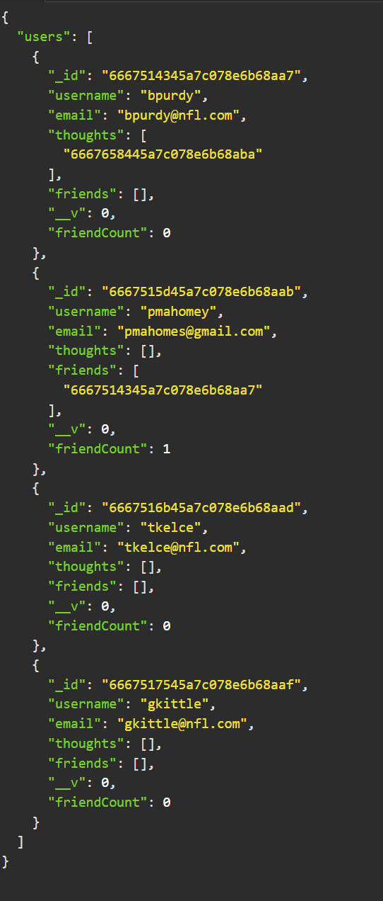
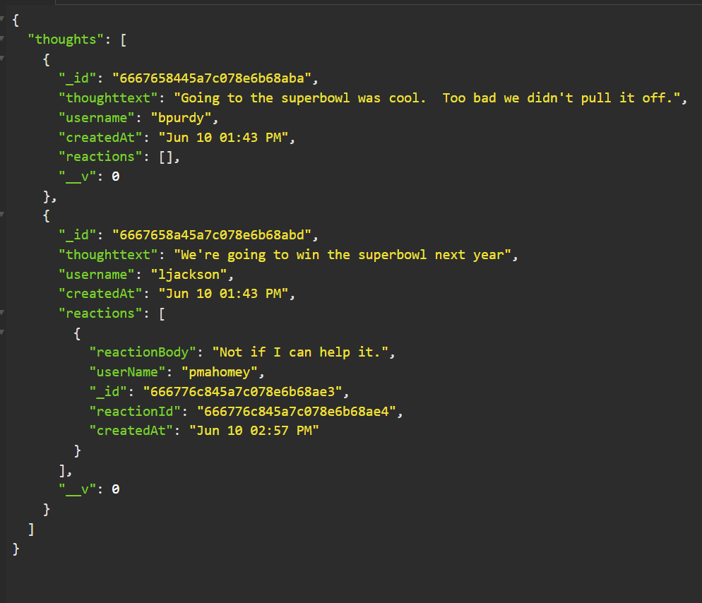

# Social_Network_API

## Description

Create a MongoDB database to create unstructured datasets, rather than a SQL structured database. Mongoose for the object data modeling and express for the routes is used to build a Social Networking API. The API contains the schemas Users and Thoughts as the primary schemas.

The User schema contain a self join to itself in order to add friends and the column displays an array of friend ids'. Similarly, when a user adds a thought, an array of thoughtids' is displayed by a reference to the Thoughts table. A virtual function friendCount displays the number of friends a user has.

The Thoughts schema contains a reference to the reactions schema. When a user enters a thought, each user can enter reaction text to the thought and they are stored in an object array.

A virtual function is used in each schema using the DayJS API to format dates into a clean consistent format.

Express allows the user to enter the get, put, post, and delete routes to use in the API client called Insomnia.

The routes mapped from Express and used in Insomnia testing are:
FriendAdd(POST):
http://localhost:3001/api/users/6667515d45a7c078e6b68aab/friends/6667514c45a7c078e6b68aa9

FriendDelete(DELETE):
http://localhost:3001/api/users/6667515d45a7c078e6b68aab/friends/6667514c45a7c078e6b68aa9

ReactionDelete(Delete):
http://localhost:3001/api/thoughts/6667658445a7c078e6b68aba/reactions/666776c145a7c078e6b68adf

ReactionPost:(POST):
http://localhost:3001/api/thoughts/6667658445a7c078e6b68aba/reactions

ThoughtDelete(Delete):
http://localhost:3001/api/thoughts/666136c8947f8b6bce005510

ThoughtGetById(GET):
http://localhost:3001/api/thoughts/6667658445a7c078e6b68aba

ThoughtPost(POST):
http://localhost:3001/api/thoughts

ThoughtsGet(GET):
http://localhost:3001/api/thoughts

ThoughtsUpdate(PUT):
http://localhost:3001/api/thoughts/6667658445a7c078e6b68aba

UserDelete(Delete):
http://localhost:3001/api/users/6667514c45a7c078e6b68aa9

UserGetById:(GET):
http://localhost:3001/api/users/6667515d45a7c078e6b68aab

UserPost(POST):
http://localhost:3001/api/users/

UserPut(Put):
http://localhost:3001/api/users/6667515d45a7c078e6b68aab

UsersGet(GET):
http://localhost:3001/api/users/

## Installation

N/A

## Usage

As a tester in Insomnia, first i want to invoke the api by typing npm run in the console. I can also insure the database and models are created by viewing them in MongoDB Compass. Opening GET routes for Users and Thoughts displays a JSON format for the results.
Users

Thoughts

POST, PUT, and DELETE API routes add, update, and delete users and thoughts.
Additionally, friends can be added or deleted from users and reactions can be added to thoughts. The images above should display an array of added friends by id to users and added reactions to thoughts.

Screencastify Link:
https://drive.google.com/file/d/1uUxwRoYRUkuAKL0alLmvigBOD-9GcsXj/view

The link to the GitHub repository is:
https://github.com/rethomas67/Social_Network_API

## Credits

N/A

## License

N/A
